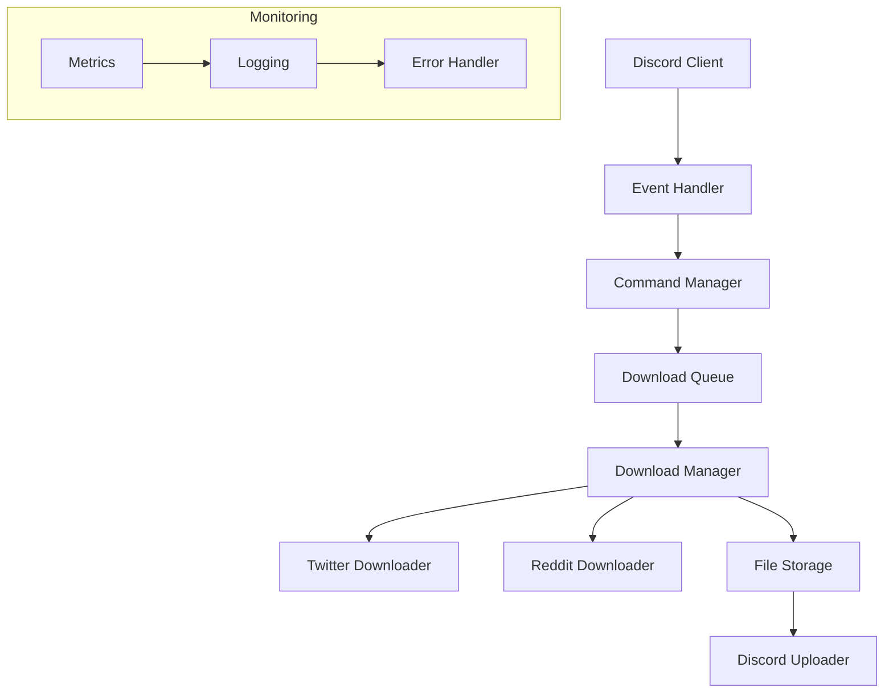
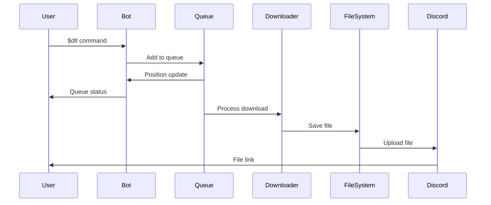

# Architecture for Boss-Bot: A Discord Media Download and RAG Assistant

Status: Draft

## Technical Summary

Boss-Bot is a Discord bot designed to provide reliable media download capabilities from platforms like Twitter and Reddit, with a foundation for future RAG (Retrieval-Augmented Generation) features. The architecture follows a modular, event-driven design using Python 3.12 and discord.py as the core framework. The system implements a robust queue management system for downloads, comprehensive error handling, and a test-driven development approach.

## Technology Table

| Technology | Description | Version |
|------------|-------------|----------|
| Python | Primary development language, chosen for strong async support and modern features | >=3.12 |
| discord.py | Discord bot framework providing event handling and API integration | >=2.5.2 |
| gallery-dl | Media download utility for Twitter, Reddit, and other platforms | >=1.29.3 |
| yt-dlp | YouTube/video download utility for extended platform support | Latest |
| httpx | Modern HTTP client for async API interactions | Latest |
| pydantic | Data validation and settings management | >=2.0 |
| pydantic-settings | Environment configuration management | Latest |
| loguru | Advanced logging with structured output | Latest |
| pytest | Testing framework with async support | Latest |
| pytest-asyncio | Async test support | Latest |
| dpytest | Discord.py testing utilities | Latest |
| better-exceptions | Enhanced exception handling and formatting | Latest |
| ruff | Fast Python linter and formatter written in Rust | Latest |
| uv | Modern Python package manager for dependency management | Latest |

## Architectural Diagrams

### Core System Architecture



### Download Flow



## Environment Configuration

### Settings Management
```python
from pydantic_settings import BaseSettings
from pydantic import SecretStr

class BotSettings(BaseSettings):
    """Bot configuration settings."""
    # Sensitive data using SecretStr
    discord_token: SecretStr

    # Basic configuration
    command_prefix: str = "$"
    max_concurrent_downloads: int = 5
    max_queue_size: int = 50

    class Config:
        env_prefix = "BOSS_BOT_"
```

### Required Environment Variables
```bash
# Required
BOSS_BOT_DISCORD_TOKEN=required      # Discord bot token (sensitive)
BOSS_BOT_COMMAND_PREFIX=$            # Command prefix (optional)

# Optional with defaults
BOSS_BOT_MAX_CONCURRENT_DOWNLOADS=5
BOSS_BOT_MAX_QUEUE_SIZE=50
```

## Data Models

### Core Models

```python
from datetime import datetime
from typing import Optional, List
from uuid import UUID
from pydantic import BaseModel, HttpUrl

class DownloadStatus(str, Enum):
    """Status of a download item."""
    QUEUED = "queued"
    DOWNLOADING = "downloading"
    COMPLETED = "completed"
    FAILED = "failed"
    CANCELLED = "cancelled"

class DownloadPriority(int, Enum):
    """Priority levels for downloads."""
    LOW = 0
    NORMAL = 1
    HIGH = 2

class DownloadItem(BaseModel):
    """Represents a single download request."""
    id: UUID
    url: HttpUrl
    status: DownloadStatus
    priority: DownloadPriority
    user_id: int
    guild_id: int
    channel_id: int
    created_at: datetime
    progress: float = 0.0
    total_size: Optional[int] = None
    error_message: Optional[str] = None

class QueueState(BaseModel):
    """Represents the current state of the download queue."""
    items: List[DownloadItem]
    active_downloads: int
    total_items: int
    queue_size: int

    @property
    def is_full(self) -> bool:
        return self.total_items >= self.queue_size

class ErrorResponse(BaseModel):
    """Standardized error response."""
    error_code: str
    message: str
    details: Optional[str] = None
    timestamp: datetime = Field(default_factory=datetime.utcnow)
```

## Project Structure

```
boss-bot/
├── src/
│   ├── boss_bot/
│   │   ├── bot/           # Discord bot core
│   │   ├── commands/      # Command implementations
│   │   ├── core/          # Core functionality
│   │   ├── downloaders/   # Download implementations
│   │   ├── schemas/       # Data models
│   │   └── utils/         # Utilities
├── tests/                 # Test suite
├── docs/                  # Documentation
└── scripts/              # Utility scripts
```

## Infrastructure

### Development Environment
- Local development using Python virtual environments
- UV for dependency management
- Pre-commit hooks for code quality
- pytest for testing infrastructure

### Production Environment
- Python 3.12+ runtime
- Persistent storage for temporary files
- Discord API integration
- Logging and monitoring setup

### Resource Requirements
- CPU: 1-2 cores
- Memory: 512MB minimum
- Storage: 5GB minimum for temporary files
- Network: Stable internet connection

## Deployment Plan

### Phase 1: MVP Setup
1. Initialize Python project with UV
2. Set up testing infrastructure
3. Implement basic Discord bot framework
4. Add core download functionality
5. Implement queue management

### Phase 2: Enhanced Features
1. Add progress tracking
2. Implement file management
3. Add error handling
4. Set up monitoring
5. Add user management

### Phase 3: Future RAG Integration
1. Set up vector store
2. Implement document processing
3. Add RAG functionality
4. Enhance command set

## Testing Strategy

### Coverage Requirements
```python
COVERAGE_TARGETS = {
    "core_download": 0.30,  # 30% coverage
    "command_parsing": 0.30,
    "discord_events": 0.30,
    "file_management": 0.30
}
```

### Test Infrastructure
```python
# conftest.py example
import pytest
import discord.ext.test as dpytest
from discord.ext import commands

@pytest.fixture
async def bot():
    """Create a bot instance for testing."""
    intents = discord.Intents.default()
    intents.message_content = True
    bot = commands.Bot(command_prefix="$", intents=intents)
    await bot._async_setup_hook()
    dpytest.configure(bot)
    yield bot
    await dpytest.empty_queue()

@pytest.fixture
def mock_download():
    """Mock download functionality."""
    with patch("boss_bot.downloaders.base.Downloader") as mock:
        yield mock
```

### Integration Test Examples
```python
@pytest.mark.asyncio
class TestDownloadCommand:
    async def test_download_flow(self, bot, mock_download):
        """Test complete download flow."""
        # Arrange
        url = "https://twitter.com/user/status/123"
        mock_download.download.return_value = "video.mp4"

        # Act
        await dpytest.message(f"$dlt {url}")

        # Assert
        assert dpytest.verify().message().contains("Download started")
        mock_download.download.assert_called_once_with(url)
        assert dpytest.verify().message().contains("Download complete")

    async def test_invalid_url(self, bot):
        """Test error handling for invalid URLs."""
        # Act
        await dpytest.message("$dlt not_a_url")

        # Assert
        assert dpytest.verify().message().contains("Invalid URL")

    async def test_queue_management(self, bot, mock_download):
        """Test queue handling with multiple downloads."""
        # Arrange
        urls = [f"https://twitter.com/user/status/{i}" for i in range(3)]

        # Act
        for url in urls:
            await dpytest.message(f"$dlt {url}")

        # Assert
        assert dpytest.verify().message().contains("Position in queue: 3")
```

## Error Handling and Logging

### Logging Configuration
```python
import sys
from loguru import logger
import better_exceptions

# Enable better exception formatting
better_exceptions.hook()

# Configure Loguru
logger.remove()  # Remove default handler
logger.configure(
    handlers=[
        {
            "sink": sys.stdout,
            "format": "<green>{time:YYYY-MM-DD HH:mm:ss.SSS}</green> | <level>{level: <8}</level> | <cyan>{name}</cyan>:<cyan>{function}</cyan>:<cyan>{line}</cyan> - <level>{message}</level>",
            "level": "INFO",
            "colorize": True,
            "backtrace": True,
            "diagnose": True,
            "enqueue": True,
        }
    ]
)

# Error logging handler
logger.add(
    sys.stderr,
    format="{time} | {level} | {message}",
    filter=lambda record: record["level"].name == "ERROR",
    level="ERROR",
    backtrace=True,
    diagnose=True,
)
```

### Error Handling Strategy
1. All errors are caught and logged with context
2. User-facing errors are displayed in Discord embeds
3. Stack traces are formatted using better-exceptions
4. Sensitive information is never included in error messages

Example error handler:
```python
from discord.ext import commands
from loguru import logger

class ErrorHandler(commands.Cog):
    """Handles all command errors."""

    @commands.Cog.listener()
    async def on_command_error(self, ctx: commands.Context, error: Exception):
        """Global error handler for all commands."""
        # Log the error with context
        logger.error(
            "Command error occurred",
            command=ctx.command.name if ctx.command else "Unknown",
            user_id=ctx.author.id,
            guild_id=ctx.guild.id if ctx.guild else None,
            error=str(error)
        )

        # Create user-facing error message
        embed = discord.Embed(
            title="Error Occurred",
            description=f"```python\n{better_exceptions.format_exception(error)}\n```",
            color=discord.Color.red()
        )

        # Add error context if available
        if isinstance(error, commands.CommandError):
            embed.add_field(
                name="Error Type",
                value=error.__class__.__name__,
                inline=False
            )

        await ctx.send(embed=embed)
```

### Logging Best Practices
1. Use structured logging with context:
   ```python
   logger.info(
       "Download started",
       url=url,
       user_id=user_id,
       guild_id=guild_id
   )
   ```

2. Log all state transitions:
   ```python
   logger.debug(
       "Download state changed",
       download_id=download.id,
       old_state=old_state,
       new_state=new_state
   )
   ```

3. Never log sensitive information:
   ```python
   # Good
   logger.info("Bot connected", application_id=bot.application.id)

   # Bad - never log tokens or sensitive data
   logger.info("Bot connected with token", token=token)  # Don't do this!
   ```

## Change Log

| Version | Date | Author | Changes |
|---------|------|--------|----------|
| 0.1.0 | 2024-04-17 | @bossjones | Initial architecture draft |
| 0.1.1 | 2024-04-17 | @bossjones | Added testing strategy and error handling |
