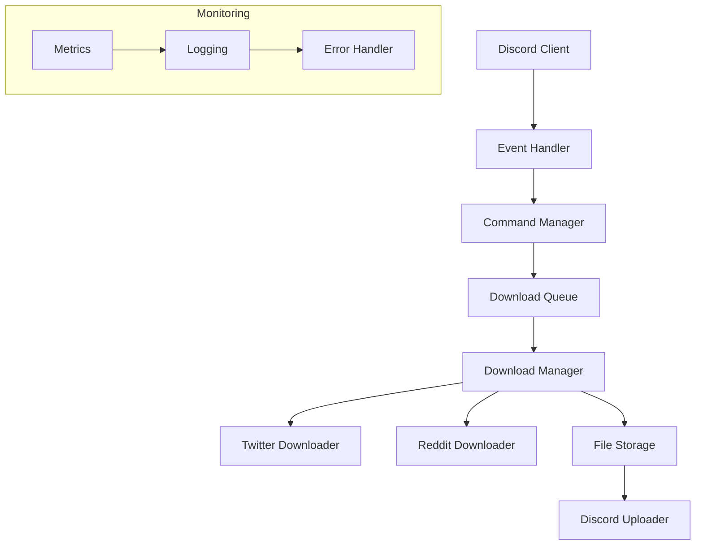
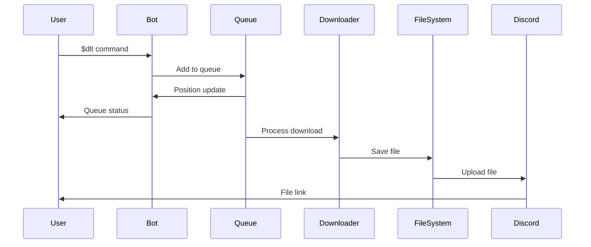

# Architecture for Boss-Bot: A Discord Media Download and RAG Assistant

Status: Draft

## Technical Summary

Boss-Bot is a Discord bot designed to provide reliable media download capabilities from platforms like Twitter and Reddit, with a foundation for future RAG (Retrieval-Augmented Generation) features. The architecture follows a modular, event-driven design using Python 3.12 and discord.py as the core framework. The system implements a robust queue management system for downloads, comprehensive error handling, and a test-driven development approach.

## Technology Table

| Technology | Description |
|------------|-------------|
| Python 3.12 | Primary development language, chosen for strong async support and modern features |
| discord.py | Discord bot framework providing event handling and API integration |
| gallery-dl | Media download utility for Twitter, Reddit, and other platforms |
| yt-dlp | YouTube/video download utility for extended platform support |
| httpx | Modern HTTP client for async API interactions |
| pydantic | Data validation and settings management |
| loguru | Advanced logging with structured output |
| pytest | Testing framework with async support |
| ruff | Fast Python linter and formatter written in Rust |
| uv | Modern Python package manager for dependency management |

## Architectural Diagrams

### Core System Architecture



### Download Flow



## Data Models

### Core Models

```python
class DownloadItem(BaseModel):
    """Represents a single download request."""
    id: UUID
    url: HttpUrl
    status: DownloadStatus
    priority: DownloadPriority
    user_id: int
    guild_id: int
    channel_id: int
    created_at: datetime
    progress: float = 0.0
    total_size: Optional[int] = None
    error_message: Optional[str] = None

class QueueState(BaseModel):
    """Represents the current state of the download queue."""
    items: List[DownloadItem]
    active_downloads: int
    total_items: int
    queue_size: int
```

## Project Structure

```
boss-bot/
├── src/
│   ├── boss_bot/
│   │   ├── bot/           # Discord bot core
│   │   ├── commands/      # Command implementations
│   │   ├── core/          # Core functionality
│   │   ├── downloaders/   # Download implementations
│   │   ├── schemas/       # Data models
│   │   └── utils/         # Utilities
├── tests/                 # Test suite
├── docs/                  # Documentation
└── scripts/              # Utility scripts
```

## Infrastructure

### Development Environment
- Local development using Python virtual environments
- UV for dependency management
- Pre-commit hooks for code quality
- pytest for testing infrastructure

### Production Environment
- Python 3.12+ runtime
- Persistent storage for temporary files
- Discord API integration
- Logging and monitoring setup

### Resource Requirements
- CPU: 1-2 cores
- Memory: 512MB minimum
- Storage: 5GB minimum for temporary files
- Network: Stable internet connection

## Deployment Plan

### Phase 1: MVP Setup
1. Initialize Python project with UV
2. Set up testing infrastructure
3. Implement basic Discord bot framework
4. Add core download functionality
5. Implement queue management

### Phase 2: Enhanced Features
1. Add progress tracking
2. Implement file management
3. Add error handling
4. Set up monitoring
5. Add user management

### Phase 3: Future RAG Integration
1. Set up vector store
2. Implement document processing
3. Add RAG functionality
4. Enhance command set

## Change Log

| Version | Date | Author | Changes |
|---------|------|--------|----------|
| 0.1.0 | 2024-04-17 | @bossjones | Initial architecture draft |
