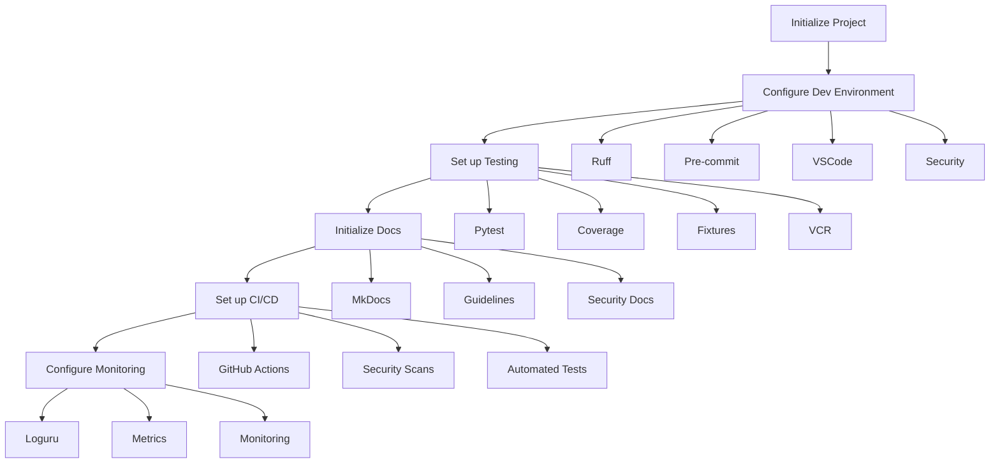

# Epic-1 - Story-1
# Project Initialization and Environment Setup

**As a** developer
**I want** to set up the initial project structure and development environment with security and monitoring foundations
**so that** we have a solid, secure, and observable foundation for building the Boss-Bot Discord media download assistant

## Status

In Progress

## Context

This is the first story of Epic-1 (Core Bot Infrastructure) which sets up the foundational project structure and development environment. This story is critical as it establishes:

- Basic project structure following the defined layout
- Development environment configuration
- Code quality tools and standards
- Initial test infrastructure
- Documentation foundation
- Security baseline
- Monitoring setup
- CI/CD pipeline foundation

Key technical decisions from the PRD and architecture documents:
- Python 3.12 as the primary development language
- UV for package management
- Ruff for code quality
- Pytest for testing infrastructure
- Comprehensive test coverage targets for MVP
- Loguru for logging
- Better-exceptions for error handling
- Security-first approach with proper environment variable handling
- Monitoring and metrics collection from the start

## Estimation

Story Points: 5 (5 days human development = 50 minutes AI development)
Increased from 3 to 5 points due to additional security, monitoring, and CI/CD requirements.

## Tasks

1. - [🚧] Initialize Python Project
   1. - [✅] Create project structure following PRD layout
   2. - [✅] Set up pyproject.toml with initial dependencies
   3. - [✅] Configure UV for package management
      * ✅ UV v0.6.13 installed and configured
      * ✅ Dependencies properly managed in pyproject.toml
      * ✅ Dev dependencies correctly configured
      * ✅ UV workspace setup complete
   4. - [✅] Create initial README.md with setup instructions
   5. - [✅] Set up secure environment variable handling
      * ✅ Implemented comprehensive pydantic-settings configuration
      * ✅ Added secure secret handling with SecretStr
      * ✅ Added validation for all environment variables
      * ✅ Configured .env and secrets directory support
      * ✅ Added type safety and validation for all settings
   6. - [ ] Configure dependency security scanning
   7. - [ ] Set up initial health checks
   8. - [✅] Configure storage directory structure

2. - [🚧] Configure Development Environment
   1. - [✅] Set up Ruff for linting and formatting
      * ✅ Basic configuration in pyproject.toml
      * ✅ Integrated with pre-commit hooks
      * ✅ Configured with two hooks: ruff (linting) and ruff-format (formatting)
      * ✅ Set to run before each commit with --fix and --exit-non-zero-on-fix
      * ✅ Properly ordered before other formatting tools
   2. - [✅] Configure pre-commit hooks
      * ✅ Added validate-pyproject for pyproject.toml validation
      * ✅ Added gitleaks for secret scanning
      * ✅ Added ruff and ruff-format hooks
      * ✅ Added additional code quality hooks
      * ✅ Configured to run on pre-commit, commit-msg, and pre-push
   3. - [✅] Set up VSCode settings
   4. - [✅] Create .env.sample with required variables
      * ✅ Added all required environment variables
      * ✅ Added descriptive comments and sections
      * ✅ Included default values from env.py
      * ✅ Added placeholders for sensitive values
   5. - [ ] Set up development secrets management
   6. - [ ] Configure development security checks
   7. - [✅] Set up detailed VSCode configuration
   8. - [ ] Configure dependency review automation

3. - [ ] Set up Test Infrastructure
   1. - [ ] Configure pytest with required plugins
   2. - [ ] Set up test directory structure
   3. - [ ] Create initial test fixtures
   4. - [ ] Configure coverage reporting
   5. - [ ] Set up VCR for HTTP mocking
   6. - [ ] Configure test security scanning
   7. - [ ] Set up async test support
   8. - [ ] Configure parallel testing
   9. - [ ] Set up Discord.py testing utilities

4. - [ ] Initialize Documentation
   1. - [ ] Set up MkDocs with required extensions
   2. - [ ] Create initial documentation structure
   3. - [ ] Document setup process
   4. - [ ] Add development guidelines
   5. - [ ] Add security guidelines
   6. - [ ] Document monitoring setup
   7. - [ ] Create troubleshooting guide
   8. - [ ] Create code style guide
   9. - [ ] Create testing guide
   10. - [ ] Create storage management guide

5. - [ ] Set up CI/CD Pipeline
   1. - [ ] Configure GitHub Actions workflow
   2. - [ ] Set up dependency scanning
   3. - [ ] Configure automated testing
   4. - [ ] Set up code quality checks
   5. - [ ] Configure security scanning
   6. - [ ] Set up documentation building
   7. - [ ] Configure automated deployments
   8. - [ ] Set up CodeQL analysis
   9. - [ ] Configure dependency review
   10. - [ ] Set up release drafting

6. - [ ] Configure Monitoring Foundation
   1. - [ ] Set up loguru configuration
   2. - [ ] Configure better-exceptions
   3. - [ ] Set up basic metrics collection
   4. - [ ] Configure log rotation
   5. - [ ] Set up monitoring dashboard structure
   6. - [ ] Configure resource usage monitoring
   7. - [ ] Set up security event logging
   8. - [ ] Set up health check endpoints
   9. - [ ] Set up storage monitoring
   10. - [ ] Set up performance profiling

7. - [🚧] Initialize Storage Structure
   1. - [✅] Set up temporary storage directory structure
      * ✅ Created main downloads directory
      * ✅ Created temp storage directory
      * ✅ Created completed downloads directory
      * ✅ Created failed downloads directory
      * ✅ Added comprehensive tests (100% coverage)
      * ✅ Implemented idempotent creation
      * ✅ Added file preservation checks
   2. - [✅] Add file validation checks to QuotaManager
      * ✅ File type validation - Implemented in FileValidator with ALLOWED_EXTENSIONS
      * ✅ File name sanitization - Implemented with sanitize_filename method
      * ✅ Basic security checks - Implemented path traversal detection and forbidden character validation
      * ✅ Test coverage: 57% for validation.py
   3. - [ ] ~~Configure cleanup policies~~ (Deferred to Phase 2)
   4. - [✅] Set up storage quota management
      * ✅ Basic quota tracking with byte and megabyte reporting
      * ✅ File size limits (50MB per file)
      * ✅ Concurrent download limits (5 max)
      * ✅ Quota status reporting with usage percentage
      * ✅ Test coverage: 96% for quotas.py
   5. - [ ] ~~Configure backup locations~~ (Deferred to Phase 2)
   6. - [ ] ~~Set up storage monitoring~~ (Deferred to Phase 2)
   7. - [ ] ~~Configure storage security~~ (Deferred to Phase 3)

## Deferred Tasks
The following tasks have been deferred to future phases:

1. Storage Management (Task Group 7)
   - Configure cleanup policies (Phase 2)
   - Configure backup locations (Phase 2)
   - Set up storage monitoring (Phase 2)
   - Configure storage security (Phase 3)

Rationale for Deferral:
- These features belong to later phases per phased development plan
- Not critical for MVP functionality
- Current focus is on core bot infrastructure and basic file validation

## Constraints

- Python 3.12+ required
- Maximum module size: 120 lines
- Test coverage targets (MVP):
  * Core Download: 30%
  * Command Parsing: 25%
  * Discord Events: 20%
  * File Management: 20%
- Maximum concurrent downloads: 5
- Maximum queue size: 50 items
- Maximum file size: 50MB
- Secure environment variable handling required
- Monitoring metrics must be collected from start

## Data Models / Schema

```python
# pyproject.toml structure
[project]
name = "boss-bot"
version = "0.1.0"
requires-python = ">=3.12"
dependencies = [
    "discord-py>=2.5.2",
    "gallery-dl>=1.29.3",
    "loguru>=0.7.3",
    "pydantic-settings>=2.8.1",
    "better-exceptions>=0.3.3",
    "prometheus-client>=0.17.1",
    "pytest-recording>=0.13.0",
    "pytest-cov>=4.1.0",
    "mkdocs-material>=9.4.0",
    "pytest-asyncio>=0.23.0",
    "pytest-mock>=3.12.0",
    "pytest-timeout>=2.2.0",
    "pytest-xdist>=3.5.0",
    "respx>=0.20.2",
    "dpytest>=0.7.0",
]

[tool.pytest.ini_options]
testpaths = ["tests"]
python_files = ["test_*.py"]
addopts = """
    --cov=boss_bot
    --cov-report=xml
    --cov-report=term-missing
    --asyncio-mode=auto
    --numprocesses=auto
    --dist=loadfile
"""

[tool.ruff]
line-length = 88
target-version = "py312"
select = [
    "E",   # pycodestyle errors
    "W",   # pycodestyle warnings
    "F",   # pyflakes
    "I",   # isort
    "C",   # flake8-comprehensions
    "B",   # flake8-bugbear
]
```

## Structure

Following the project structure from the PRD:

```text
boss-bot/
├── .github/
│   └── workflows/
│       ├── ci.yml
│       ├── dependency-review.yml
│       ├── codeql-analysis.yml
│       ├── security-audit.yml
│       ├── release-drafter.yml
│       └── security.yml
├── src/
│   ├── boss_bot/
│   │   ├── bot/
│   │   ├── commands/
│   │   ├── core/
│   │   ├── downloaders/
│   │   ├── schemas/
│   │   ├── monitoring/
│   │   │   ├── metrics.py
│   │   │   ├── health.py
│   │   │   └── logging.py
│   │   ├── storage/
│   │   │   ├── cleanup.py
│   │   │   ├── quotas.py
│   │   │   └── validation.py
│   │   └── utils/
├── tests/
│   ├── conftest.py
│   ├── test_bot/
│   ├── test_commands/
│   ├── test_downloaders/
│   ├── test_storage/
│   └── cassettes/
├── docs/
│   ├── development/
│   │   ├── code_style.md
│   │   ├── testing_guide.md
│   │   ├── security_practices.md
│   │   ├── monitoring_guide.md
│   │   ├── storage_management.md
│   │   └── deployment_guide.md
│   ├── setup.md
│   ├── security.md
│   ├── monitoring.md
│   └── troubleshooting.md
├── scripts/
├── .vscode/
│   ├── settings.json
│   ├── launch.json
│   └── extensions.json
├── .env.sample
├── .pre-commit-config.yaml
├── pyproject.toml
└── README.md
```

## Diagrams



## Dev Notes

- Ensure all dependencies are pinned to specific versions for reproducibility
- Configure Ruff to enforce type hints and docstrings
- Set up pre-commit hooks to run before each commit
- Create comprehensive test fixtures for Discord bot testing
- Document all setup steps clearly for other developers
- Implement security best practices from the start
- Set up monitoring and metrics collection early
- Set up CI/CD pipeline includes security checks
- Configure proper secret management
- Set up automated dependency updates with security checks
- ✅ Implemented file validation with comprehensive tests (coverage: 57% for validation.py)
  * Added support for common media file types
  * Implemented secure filename sanitization
  * Added path traversal detection
  * Created thorough test suite with edge cases
- ✅ Implemented storage quota management (coverage: 96% for quotas.py)
  * Added quota tracking with byte/MB reporting
  * Implemented file size and concurrent download limits
  * Created comprehensive test suite
  * Added detailed status reporting
- ✅ Implemented storage directory structure (100% test coverage)
  * Created required directory hierarchy
  * Added idempotent creation
  * Ensured file preservation
  * Added comprehensive test suite

## Chat Command Log

No commands executed yet - initial story creation.

## Implementation Evidence

### Environment Configuration
1. Environment Settings:
   - Location: src/boss_bot/core/env.py
   - Key Features:
     * Comprehensive pydantic-settings implementation
     * Secure secret handling with SecretStr
     * Validation for all environment variables
     * Support for .env and secrets directory
     * Type safety and validation
     * Environment-specific configuration

2. Package Management:
   - Location: pyproject.toml, uv.lock
   - Features:
     * UV v0.6.13 configuration
     * Properly managed dependencies
     * Dev dependencies setup
     * Workspace configuration
     * Version pinning

3. Environment Templates:
   - Location: .env.sample
   - Features:
     * Complete environment variable listing
     * Organized sections with comments
     * Default values from env.py
     * Secure placeholders for API keys
     * Development-focused defaults

### Storage Management Implementation
1. Storage Quota System:
   - Location: src/boss_bot/storage/quotas.py
   - Test Coverage: 96%
   - Key Features:
     * File size limits (50MB)
     * Concurrent download tracking
     * Usage reporting
     * Comprehensive test suite

2. File Validation:
   - Location: src/boss_bot/storage/validation.py
   - Test Coverage: 57%
   - Key Features:
     * File type validation
     * Name sanitization
     * Security checks
     * Path traversal prevention

3. Storage Structure:
   - Location: src/boss_bot/storage/
   - Test Coverage: 100% for directory management
   - Features:
     * Organized directory hierarchy
     * Idempotent creation
     * File preservation
     * Comprehensive tests

### Development Environment
1. Pre-commit Configuration:
   - Location: .pre-commit-config.yaml
   - Key Features:
     * Ruff integration with two hooks:
       - ruff: Linting with --fix and --exit-non-zero-on-fix
       - ruff-format: Formatting with proper configuration
     * Comprehensive hook setup for code quality
     * Multiple git hooks configured (pre-commit, commit-msg, pre-push)
     * Proper hook ordering for optimal formatting
     * Validation hooks for project configuration

2. Environment Settings:
   - Location: src/boss_bot/core/env.py
   - Key Features:
     * Comprehensive pydantic-settings implementation
     * Secure secret handling with SecretStr
     * Validation for all environment variables
     * Support for .env and secrets directory
     * Type safety and validation
     * Environment-specific configuration
