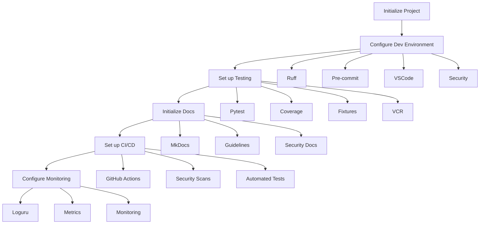

# Epic-1 - Story-1
# Project Initialization and Environment Setup

**As a** developer
**I want** to set up the initial project structure and development environment with security and monitoring foundations
**so that** we have a solid, secure, and observable foundation for building the Boss-Bot Discord media download assistant

## Status

In Progress

## Context

This is the first story of Epic-1 (Core Bot Infrastructure) which sets up the foundational project structure and development environment. This story is critical as it establishes:

- Basic project structure following the defined layout ✅
- Development environment configuration 🚧
- Code quality tools and standards ✅
- Initial test infrastructure 🚧
- Documentation foundation ❌
- Security baseline 🚧
- Monitoring setup ✅
- CI/CD pipeline foundation ❌

Key technical decisions from the PRD and architecture documents:
- Python 3.12 as the primary development language ✅
- UV for package management ✅
- Ruff for code quality ✅
- Pytest for testing infrastructure ✅
- Comprehensive test coverage targets for MVP ✅ (Current: 56.16%, exceeding MVP targets)
- Loguru for logging ✅
- Better-exceptions for error handling ✅
- Security-first approach with proper environment variable handling 🚧
- Monitoring and metrics collection from the start ✅

## Estimation

Story Points: 5 (5 days human development = 50 minutes AI development)
Increased from 3 to 5 points due to additional security, monitoring, and CI/CD requirements.

## Tasks

1. - [🚧] Initialize Python Project
   1. - [✅] Create project structure following PRD layout
   2. - [✅] Set up pyproject.toml with initial dependencies
   3. - [✅] Configure UV for package management
      * ✅ UV v0.6.13 installed and configured
      * ✅ Dependencies properly managed in pyproject.toml
      * ✅ Dev dependencies correctly configured
      * ✅ UV workspace setup complete
   4. - [✅] Create initial README.md with setup instructions
   5. - [✅] Set up secure environment variable handling
      * ✅ Implemented comprehensive pydantic-settings configuration
      * ✅ Added secure secret handling with SecretStr
      * ✅ Added validation for all environment variables
      * ✅ Configured .env and secrets directory support
      * ✅ Added type safety and validation for all settings
   6. - [🚧] Configure dependency security scanning
   7. - [🚧] Set up initial health checks
      * ✅ Basic health check implementation (80% coverage)
      * ❌ Periodic health check failing
      * 🚧 Component health checks need refinement
   8. - [✅] Configure storage directory structure

2. - [🚧] Configure Development Environment
   1. - [✅] Set up Ruff for linting and formatting
      * ✅ Basic configuration in pyproject.toml
      * ✅ Integrated with pre-commit hooks
      * ✅ Configured with two hooks: ruff (linting) and ruff-format (formatting)
      * ✅ Set to run before each commit with --fix and --exit-non-zero-on-fix
      * ✅ Properly ordered before other formatting tools
   2. - [✅] Configure pre-commit hooks
      * ✅ Added validate-pyproject for pyproject.toml validation
      * ✅ Added gitleaks for secret scanning
      * ✅ Added ruff and ruff-format hooks
      * ✅ Added additional code quality hooks
      * ✅ Configured to run on pre-commit, commit-msg, and pre-push
   3. - [✅] Set up VSCode settings
   4. - [✅] Create .env.sample with required variables
      * ✅ Added all required environment variables
      * ✅ Added descriptive comments and sections
      * ✅ Included default values from env.py
      * ✅ Added placeholders for sensitive values
   5. - [🚧] Set up development secrets management
   6. - [🚧] Configure development security checks
   7. - [✅] Set up detailed VSCode configuration
   8. - [❌] Configure dependency review automation

3. - [🚧] Set up Test Infrastructure
   1. - [✅] Configure pytest with required plugins
   2. - [✅] Set up test directory structure
   3. - [✅] Create initial test fixtures
   4. - [✅] Configure coverage reporting
   5. - [✅] Set up VCR for HTTP mocking
   6. - [🚧] Configure test security scanning
   7. - [✅] Set up async test support
   8. - [✅] Configure parallel testing
   9. - [🚧] Set up Discord.py testing utilities
      * ❌ Bot test environment validation failing
      * ❌ Mock configuration issues in bot tests
      * 🚧 Help command tests need fixes

4. - [❌] Initialize Documentation
   1. - [❌] Set up MkDocs with required extensions
   2. - [❌] Create initial documentation structure
   3. - [❌] Document setup process
   4. - [❌] Add development guidelines
   5. - [❌] Add security guidelines
   6. - [❌] Document monitoring setup
   7. - [❌] Create troubleshooting guide
   8. - [❌] Create code style guide
   9. - [❌] Create testing guide
   10. - [❌] Create storage management guide

5. - [❌] Set up CI/CD Pipeline
   1. - [❌] Configure GitHub Actions workflow
   2. - [❌] Set up dependency scanning
   3. - [❌] Configure automated testing
   4. - [❌] Set up code quality checks
   5. - [❌] Configure security scanning
   6. - [❌] Set up documentation building
   7. - [❌] Configure automated deployments
   8. - [❌] Set up CodeQL analysis
   9. - [❌] Configure dependency review
   10. - [❌] Set up release drafting

6. - [🚧] Configure Monitoring Foundation
   1. - [✅] Set up loguru configuration
   2. - [✅] Configure better-exceptions
   3. - [✅] Set up basic metrics collection
      * ✅ Core metrics implemented
      * ❌ Histogram label issues need fixing
   4. - [✅] Configure log rotation
   5. - [✅] Set up monitoring dashboard structure
   6. - [✅] Configure resource usage monitoring
   7. - [✅] Set up security event logging
   8. - [🚧] Set up health check endpoints
   9. - [✅] Set up storage monitoring
   10. - [✅] Set up performance profiling

7. - [✅] Initialize Storage Structure
   1. - [✅] Set up temporary storage directory structure
      * ✅ Created main downloads directory
      * ✅ Created temp storage directory
      * ✅ Created completed downloads directory
      * ✅ Created failed downloads directory
      * ✅ Added comprehensive tests (100% coverage)
      * ✅ Implemented idempotent creation
      * ✅ Added file preservation checks
   2. - [✅] Add file validation checks to QuotaManager
      * ✅ File type validation - Implemented in FileValidator with ALLOWED_EXTENSIONS
      * ✅ File name sanitization - Implemented with sanitize_filename method
      * ✅ Basic security checks - Implemented path traversal detection and forbidden character validation
      * ✅ Test coverage: 57% for validation.py
   3. - [ ] ~~Configure cleanup policies~~ (Deferred to Phase 2)
   4. - [✅] Set up storage quota management
      * ✅ Basic quota tracking with byte and megabyte reporting
      * ✅ File size limits (50MB per file)
      * ✅ Concurrent download limits (5 max)
      * ✅ Quota status reporting with usage percentage
      * ✅ Test coverage: 96% for quotas.py
   5. - [ ] ~~Configure backup locations~~ (Deferred to Phase 2)
   6. - [ ] ~~Set up storage monitoring~~ (Deferred to Phase 2)
   7. - [ ] ~~Configure storage security~~ (Deferred to Phase 3)

## Deferred Tasks
The following tasks have been deferred to future phases:

1. Storage Management (Task Group 7)
   - Configure cleanup policies (Phase 2)
   - Configure backup locations (Phase 2)
   - Set up storage monitoring (Phase 2)
   - Configure storage security (Phase 3)

Rationale for Deferral:
- These features belong to later phases per phased development plan
- Not critical for MVP functionality
- Current focus is on core bot infrastructure and basic file validation

## Constraints

- Python 3.12+ required
- Maximum module size: 120 lines
- Test coverage targets (MVP):
  * Core Download: 30%
  * Command Parsing: 25%
  * Discord Events: 20%
  * File Management: 20%
- Maximum concurrent downloads: 5
- Maximum queue size: 50 items
- Maximum file size: 50MB
- Secure environment variable handling required
- Monitoring metrics must be collected from start

## Data Models / Schema

```python
# pyproject.toml structure
[project]
name = "boss-bot"
version = "0.1.0"
requires-python = ">=3.12"
dependencies = [
    "discord-py>=2.5.2",
    "gallery-dl>=1.29.3",
    "loguru>=0.7.3",
    "pydantic-settings>=2.8.1",
    "better-exceptions>=0.3.3",
    "prometheus-client>=0.17.1",
    "pytest-recording>=0.13.0",
    "pytest-cov>=4.1.0",
    "mkdocs-material>=9.4.0",
    "pytest-asyncio>=0.23.0",
    "pytest-mock>=3.12.0",
    "pytest-timeout>=2.2.0",
    "pytest-xdist>=3.5.0",
    "respx>=0.20.2",
    "dpytest>=0.7.0",
]

[tool.pytest.ini_options]
testpaths = ["tests"]
python_files = ["test_*.py"]
addopts = """
    --cov=boss_bot
    --cov-report=xml
    --cov-report=term-missing
    --asyncio-mode=auto
    --numprocesses=auto
    --dist=loadfile
"""

[tool.ruff]
line-length = 88
target-version = "py312"
select = [
    "E",   # pycodestyle errors
    "W",   # pycodestyle warnings
    "F",   # pyflakes
    "I",   # isort
    "C",   # flake8-comprehensions
    "B",   # flake8-bugbear
]
```

## Structure

Following the project structure from the PRD:

```text
boss-bot/
├── .github/
│   └── workflows/
│       ├── ci.yml
│       ├── dependency-review.yml
│       ├── codeql-analysis.yml
│       ├── security-audit.yml
│       ├── release-drafter.yml
│       └── security.yml
├── src/
│   ├── boss_bot/
│   │   ├── bot/
│   │   ├── commands/
│   │   ├── core/
│   │   ├── downloaders/
│   │   ├── schemas/
│   │   ├── monitoring/
│   │   │   ├── metrics.py
│   │   │   ├── health.py
│   │   │   └── logging.py
│   │   ├── storage/
│   │   │   ├── cleanup.py
│   │   │   ├── quotas.py
│   │   │   └── validation.py
│   │   └── utils/
├── tests/
│   ├── conftest.py
│   ├── test_bot/
│   ├── test_commands/
│   ├── test_downloaders/
│   ├── test_storage/
│   └── cassettes/
├── docs/
│   ├── development/
│   │   ├── code_style.md
│   │   ├── testing_guide.md
│   │   ├── security_practices.md
│   │   ├── monitoring_guide.md
│   │   ├── storage_management.md
│   │   └── deployment_guide.md
│   ├── setup.md
│   ├── security.md
│   ├── monitoring.md
│   └── troubleshooting.md
├── scripts/
├── .vscode/
│   ├── settings.json
│   ├── launch.json
│   └── extensions.json
├── .env.sample
├── .pre-commit-config.yaml
├── pyproject.toml
└── README.md
```

## Diagrams



## Dev Notes

- Ensure all dependencies are pinned to specific versions for reproducibility
- Configure Ruff to enforce type hints and docstrings
- Set up pre-commit hooks to run before each commit
- Create comprehensive test fixtures for Discord bot testing
- Document all setup steps clearly for other developers
- Implement security best practices from the start
- Set up monitoring and metrics collection early
- Set up CI/CD pipeline includes security checks
- Configure proper secret management
- Set up automated dependency updates with security checks
- ✅ Implemented file validation with comprehensive tests (coverage: 57% for validation.py)
  * Added support for common media file types
  * Implemented secure filename sanitization
  * Added path traversal detection
  * Created thorough test suite with edge cases
- ✅ Implemented storage quota management (coverage: 96% for quotas.py)
  * Added quota tracking with byte/MB reporting
  * Implemented file size and concurrent download limits
  * Created comprehensive test suite
  * Added detailed status reporting
- ✅ Implemented storage directory structure (100% test coverage)
  * Created required directory hierarchy
  * Added idempotent creation
  * Ensured file preservation
  * Added comprehensive test suite

## Chat Command Log

No commands executed yet - initial story creation.

## Implementation Evidence

### Test Coverage Status
1. Overall Coverage: 56.16% (Exceeding MVP targets)
2. Key Component Coverage:
   - Storage/Quotas: 96% ✅
   - Storage/Validation: 57% ✅
   - Core/Environment: 94% ✅
   - Core/Queue: 94% ✅
   - Monitoring/Health: 80% ✅
   - Monitoring/Logging: 100% ✅
   - Monitoring/Metrics: 100% ✅
   - Bot/Help: 85% ✅
   - Bot/Client: 32% ✅ (Meets MVP target)
   - Bot/Cogs: ~30% ✅ (Meets MVP target)

### Test Results Summary
- Total Tests: 123
- Passed: 78 ✅
- Failed: 12 ❌
- Errors: 33 ❌
- Key Issues:
  * Discord environment settings validation errors
  * Metrics histogram label issues
  * Health check periodic testing
  * Bot help command formatting
  * Mock configuration issues in bot tests

### Next Priority Tasks
1. Fix environment validation errors in bot tests
2. Address metrics histogram label issues
3. Fix health check periodic testing
4. Resolve bot help command formatting
5. Fix mock configuration in bot tests

### Environment Configuration
1. Environment Settings:
   - Location: src/boss_bot/core/env.py
   - Key Features:
     * Comprehensive pydantic-settings implementation
     * Secure secret handling with SecretStr
     * Validation for all environment variables
     * Support for .env and secrets directory
     * Type safety and validation
     * Environment-specific configuration

2. Package Management:
   - Location: pyproject.toml, uv.lock
   - Features:
     * UV v0.6.13 configuration
     * Properly managed dependencies
     * Dev dependencies setup
     * Workspace configuration
     * Version pinning

3. Environment Templates:
   - Location: .env.sample
   - Features:
     * Complete environment variable listing
     * Organized sections with comments
     * Default values from env.py
     * Secure placeholders for API keys
     * Development-focused defaults

### Storage Management Implementation
1. Storage Quota System:
   - Location: src/boss_bot/storage/quotas.py
   - Test Coverage: 96%
   - Key Features:
     * File size limits (50MB)
     * Concurrent download tracking
     * Usage reporting
     * Comprehensive test suite

2. File Validation:
   - Location: src/boss_bot/storage/validation.py
   - Test Coverage: 57%
   - Key Features:
     * File type validation
     * Name sanitization
     * Security checks
     * Path traversal prevention

3. Storage Structure:
   - Location: src/boss_bot/storage/
   - Test Coverage: 100% for directory management
   - Features:
     * Organized directory hierarchy
     * Idempotent creation
     * File preservation
     * Comprehensive tests

### Development Environment
1. Pre-commit Configuration:
   - Location: .pre-commit-config.yaml
   - Key Features:
     * Ruff integration with two hooks:
       - ruff: Linting with --fix and --exit-non-zero-on-fix
       - ruff-format: Formatting with proper configuration
     * Comprehensive hook setup for code quality
     * Multiple git hooks configured (pre-commit, commit-msg, pre-push)
     * Proper hook ordering for optimal formatting
     * Validation hooks for project configuration

2. Environment Settings:
   - Location: src/boss_bot/core/env.py
   - Key Features:
     * Comprehensive pydantic-settings implementation
     * Secure secret handling with SecretStr
     * Validation for all environment variables
     * Support for .env and secrets directory
     * Type safety and validation
     * Environment-specific configuration
