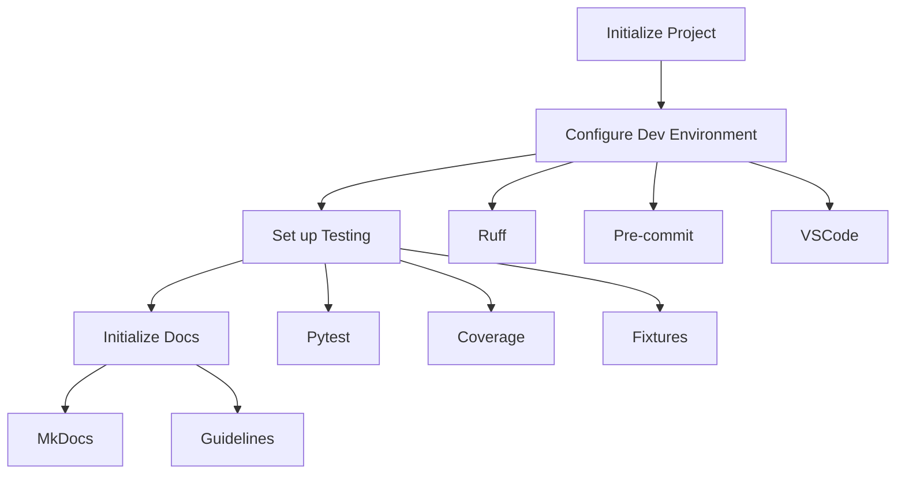

# Epic-1 - Story-1
# Project Initialization and Environment Setup

**As a** developer
**I want** to set up the initial project structure and development environment
**so that** we have a solid foundation for building the Boss-Bot Discord media download assistant

## Status

Draft

## Context

This is the first story of Epic-1 (Core Bot Infrastructure) which sets up the foundational project structure and development environment. This story is critical as it establishes:

- Basic project structure following the defined layout
- Development environment configuration
- Code quality tools and standards
- Initial test infrastructure
- Documentation foundation

Key technical decisions from the PRD and architecture documents:
- Python 3.12 as the primary development language
- UV for package management
- Ruff for code quality
- Pytest for testing infrastructure
- Comprehensive test coverage targets for MVP

## Estimation

Story Points: 3 (3 days human development = 30 minutes AI development)

## Tasks

1. - [ ] Initialize Python Project
   1. - [ ] Create project structure following PRD layout
   2. - [ ] Set up pyproject.toml with initial dependencies
   3. - [ ] Configure UV for package management
   4. - [ ] Create initial README.md with setup instructions

2. - [ ] Configure Development Environment
   1. - [ ] Set up Ruff for linting and formatting
   2. - [ ] Configure pre-commit hooks
   3. - [ ] Set up VSCode settings
   4. - [ ] Create .env.sample with required variables

3. - [ ] Set up Test Infrastructure
   1. - [ ] Configure pytest with required plugins
   2. - [ ] Set up test directory structure
   3. - [ ] Create initial test fixtures
   4. - [ ] Configure coverage reporting

4. - [ ] Initialize Documentation
   1. - [ ] Set up MkDocs with required extensions
   2. - [ ] Create initial documentation structure
   3. - [ ] Document setup process
   4. - [ ] Add development guidelines

## Constraints

- Python 3.12+ required
- Maximum module size: 120 lines
- Test coverage targets (MVP):
  * Core Download: 30%
  * Command Parsing: 25%
  * Discord Events: 20%
  * File Management: 20%

## Data Models / Schema

```python
# pyproject.toml structure
[project]
name = "boss-bot"
version = "0.1.0"
requires-python = ">=3.12"
dependencies = [
    "discord-py>=2.5.2",
    "gallery-dl>=1.29.3",
    "loguru>=0.7.3",
    "pydantic-settings>=2.8.1",
    # ... other dependencies
]

[tool.pytest.ini_options]
testpaths = ["tests"]
python_files = ["test_*.py"]
addopts = "--cov=boss_bot --cov-report=xml --cov-report=term-missing"

[tool.ruff]
line-length = 88
target-version = "py312"
```

## Structure

Following the project structure from the PRD:

```text
boss-bot/
├── src/
│   ├── boss_bot/
│   │   ├── bot/
│   │   ├── commands/
│   │   ├── core/
│   │   ├── downloaders/
│   │   ├── schemas/
│   │   └── utils/
├── tests/
│   ├── conftest.py
│   ├── test_bot/
│   ├── test_commands/
│   └── test_downloaders/
├── docs/
├── scripts/
├── pyproject.toml
└── README.md
```

## Diagrams



## Dev Notes

- Ensure all dependencies are pinned to specific versions for reproducibility
- Configure Ruff to enforce type hints and docstrings
- Set up pre-commit hooks to run before each commit
- Create comprehensive test fixtures for Discord bot testing
- Document all setup steps clearly for other developers

## Chat Command Log

No commands executed yet - initial story creation.
