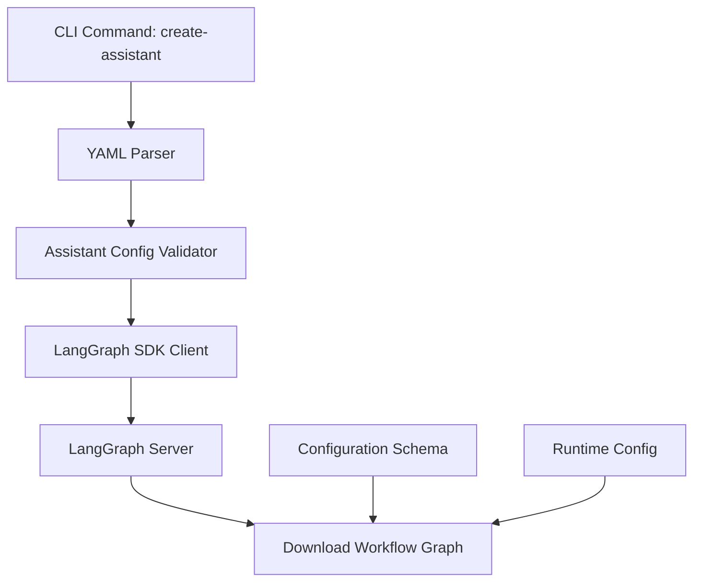

# LangGraph Assistant Management Plan

## Overview

This document outlines the implementation plan for adding LangGraph assistant management capabilities to the Boss-Bot CLI. The goal is to enable users to create, manage, and test different configurations of the download workflow using YAML files, following the LangGraph assistants pattern.

## Objectives

1. **Enable Configuration Testing**: Allow users to create and test different download workflow configurations without code changes
2. **Support A/B Testing**: Compare performance between AI-enhanced and traditional download approaches
3. **Improve Developer Experience**: Provide an easy way to manage and version control assistant configurations
4. **Enable User Customization**: Allow users to create custom assistants optimized for their specific needs

## Architecture Overview



## Implementation Details

### 1. Update Download Workflow for Configuration (Phase 1)

**File**: `src/boss_bot/ai/workflows/download_workflow.py`

**Changes Required**:
- Add `ConfigSchema` TypedDict to define configurable parameters
- Update `create_download_workflow_graph()` to accept configuration
- Make nodes configuration-aware

```python
from typing import TypedDict

class ConfigSchema(TypedDict):
    """Configuration schema for download workflow."""
    # AI Configuration
    enable_ai_strategy_selection: bool
    enable_content_analysis: bool
    ai_model: str
    ai_temperature: float

    # Download Configuration
    max_retries: int
    timeout_seconds: int
    download_quality: str

    # Platform Specific Settings
    youtube_quality: str
    twitter_include_replies: bool
    instagram_include_stories: bool
    reddit_include_comments: bool

def create_download_workflow_graph(config_schema=ConfigSchema):
    """Create configurable download workflow graph."""
    workflow = StateGraph(WorkflowState, config_schema=config_schema)
    # ... rest of implementation
```

### 2. Create Assistant Configuration Models (Phase 2)

**File**: `src/boss_bot/ai/assistants/models.py`

```python
from pydantic import BaseModel, Field
from typing import Dict, Any, Optional

class GraphConfig(BaseModel):
    """Configuration values for the graph."""
    enable_ai_strategy_selection: bool = True
    enable_content_analysis: bool = True
    ai_model: str = "gpt-4"
    ai_temperature: float = 0.7
    max_retries: int = 3
    timeout_seconds: int = 300
    download_quality: str = "best"

    # Platform specific
    youtube_quality: str = "1080p"
    twitter_include_replies: bool = False
    instagram_include_stories: bool = True
    reddit_include_comments: bool = False

class AssistantConfig(BaseModel):
    """Assistant configuration from YAML."""
    name: str = Field(..., description="Assistant name")
    description: str = Field(..., description="Assistant description")
    graph_id: str = Field(default="download_workflow", description="Graph ID to use")
    config: Dict[str, Dict[str, Any]] = Field(
        default_factory=dict,
        description="Configuration with 'configurable' key"
    )
    metadata: Optional[Dict[str, Any]] = Field(
        default_factory=dict,
        description="Additional metadata"
    )
```

### 3. Create LangGraph Client Utility (Phase 3)

**File**: `src/boss_bot/ai/assistants/client.py`

```python
from langgraph_sdk import get_client
from typing import Optional, Dict, Any
import os

class LangGraphAssistantClient:
    """Client for managing LangGraph assistants."""

    def __init__(self, deployment_url: Optional[str] = None):
        """Initialize client with deployment URL."""
        self.deployment_url = deployment_url or os.getenv(
            "LANGGRAPH_DEPLOYMENT_URL",
            "http://localhost:8123"
        )
        self._client = None

    @property
    def client(self):
        """Lazy load client."""
        if self._client is None:
            self._client = get_client(url=self.deployment_url)
        return self._client

    async def create_assistant(self, config: AssistantConfig) -> Dict[str, Any]:
        """Create a new assistant."""
        return await self.client.assistants.create(
            graph_id=config.graph_id,
            config=config.config,
            name=config.name,
            metadata={
                "description": config.description,
                **config.metadata
            }
        )

    async def list_assistants(self) -> list:
        """List all assistants."""
        return await self.client.assistants.list()

    async def delete_assistant(self, assistant_id: str) -> None:
        """Delete an assistant."""
        await self.client.assistants.delete(assistant_id)
```

### 4. Create Typer Command Module (Phase 4)

**File**: `src/boss_bot/cli/subcommands/assistants_cmd.py`

```python
import typer
import yaml
from pathlib import Path
from rich.console import Console
from rich.table import Table

from boss_bot.ai.assistants.models import AssistantConfig
from boss_bot.ai.assistants.client import LangGraphAssistantClient
from boss_bot.utils.asynctyper import AsyncTyper

app = AsyncTyper()
console = Console()

@app.command()
async def create(
    config_file: Path = typer.Argument(..., help="Path to YAML configuration file"),
    deployment_url: Optional[str] = typer.Option(None, "--url", help="LangGraph deployment URL"),
):
    """Create a new assistant from YAML configuration."""
    try:
        # Load YAML configuration
        with open(config_file) as f:
            config_data = yaml.safe_load(f)

        # Validate configuration
        config = AssistantConfig(**config_data)

        # Create assistant
        client = LangGraphAssistantClient(deployment_url)
        result = await client.create_assistant(config)

        console.print(f"[green]✅ Assistant created successfully![/green]")
        console.print(f"[cyan]Assistant ID: {result['assistant_id']}[/cyan]")
        console.print(f"[cyan]Name: {result['name']}[/cyan]")

    except Exception as e:
        console.print(f"[red]❌ Error creating assistant: {e}[/red]")
        raise typer.Exit(1)

@app.command()
async def list(
    deployment_url: Optional[str] = typer.Option(None, "--url", help="LangGraph deployment URL"),
):
    """List all assistants."""
    try:
        client = LangGraphAssistantClient(deployment_url)
        assistants = await client.list_assistants()

        # Create table
        table = Table(title="LangGraph Assistants")
        table.add_column("ID", style="cyan")
        table.add_column("Name", style="green")
        table.add_column("Graph ID", style="yellow")
        table.add_column("Created", style="blue")

        for assistant in assistants:
            table.add_row(
                assistant["assistant_id"],
                assistant["name"],
                assistant["graph_id"],
                assistant["created_at"]
            )

        console.print(table)

    except Exception as e:
        console.print(f"[red]❌ Error listing assistants: {e}[/red]")
        raise typer.Exit(1)

@app.command()
async def delete(
    assistant_id: str = typer.Argument(..., help="Assistant ID to delete"),
    deployment_url: Optional[str] = typer.Option(None, "--url", help="LangGraph deployment URL"),
    force: bool = typer.Option(False, "--force", help="Skip confirmation"),
):
    """Delete an assistant."""
    if not force:
        confirm = typer.confirm(f"Delete assistant {assistant_id}?")
        if not confirm:
            console.print("[yellow]Cancelled[/yellow]")
            raise typer.Exit(0)

    try:
        client = LangGraphAssistantClient(deployment_url)
        await client.delete_assistant(assistant_id)
        console.print(f"[green]✅ Assistant {assistant_id} deleted[/green]")
    except Exception as e:
        console.print(f"[red]❌ Error deleting assistant: {e}[/red]")
        raise typer.Exit(1)
```

### 5. Example YAML Configurations

**File**: `examples/assistants/high_quality_assistant.yaml`

```yaml
name: "High Quality Download Assistant"
description: "Optimized for maximum quality downloads with AI enhancement"
graph_id: "download_workflow"
config:
  configurable:
    # AI Features - All enabled for best quality
    enable_ai_strategy_selection: true
    enable_content_analysis: true
    ai_model: "gpt-4"
    ai_temperature: 0.3  # Lower temperature for consistency

    # Download Settings - Optimized for quality
    max_retries: 5
    timeout_seconds: 600  # 10 minutes
    download_quality: "best"

    # Platform Specific - Maximum quality
    youtube_quality: "4k"
    twitter_include_replies: true
    instagram_include_stories: true
    reddit_include_comments: true

metadata:
  version: "1.0.0"
  author: "boss-bot-team"
  use_case: "archival"
```

**File**: `examples/assistants/fast_assistant.yaml`

```yaml
name: "Fast Download Assistant"
description: "Optimized for speed with minimal processing"
graph_id: "download_workflow"
config:
  configurable:
    # AI Features - Disabled for speed
    enable_ai_strategy_selection: false
    enable_content_analysis: false

    # Download Settings - Optimized for speed
    max_retries: 1
    timeout_seconds: 120  # 2 minutes
    download_quality: "good"

    # Platform Specific - Balanced quality/speed
    youtube_quality: "720p"
    twitter_include_replies: false
    instagram_include_stories: false
    reddit_include_comments: false

metadata:
  version: "1.0.0"
  author: "boss-bot-team"
  use_case: "quick-access"
```

## Testing Strategy

### Unit Tests
- Test YAML parsing and validation
- Test configuration model validation
- Test client methods with mocked LangGraph SDK

### Integration Tests
- Test assistant creation with local LangGraph server
- Test configuration application to workflow
- Test different assistant configurations

### E2E Tests
- Create assistant from YAML
- Run download with assistant
- Compare results between different assistants

## Environment Variables

```bash
# LangGraph deployment URL
LANGGRAPH_DEPLOYMENT_URL=http://localhost:8123

# Optional: LangGraph API key for cloud deployment
LANGGRAPH_API_KEY=your-api-key

# Enable assistant features
BOSS_BOT_ENABLE_ASSISTANTS=true
```

## CLI Usage Examples

```bash
# Create an assistant from YAML
bossctl assistants create examples/assistants/high_quality_assistant.yaml

# List all assistants
bossctl assistants list

# Delete an assistant
bossctl assistants delete <assistant-id>

# Use an assistant for download
bossctl download --assistant <assistant-id> https://example.com/video
```

## Deployment Considerations

### Local Development
1. Run LangGraph server locally: `langgraph up`
2. Create assistants using local URL
3. Test with different configurations

### Production
1. Deploy to LangGraph Cloud
2. Use production URL and API keys
3. Version control assistant configurations
4. Monitor assistant performance

## Future Enhancements

1. **Assistant Versioning**: Track changes to assistant configurations
2. **Performance Metrics**: Compare download success rates between assistants
3. **Auto-tuning**: Use results to optimize configurations
4. **Template Library**: Pre-built assistant templates for common use cases
5. **Web UI**: Create assistants through Discord commands

## Dependencies

- `langgraph-sdk`: For assistant management
- `pyyaml`: For YAML parsing
- `pydantic`: For configuration validation
- Existing Boss-Bot dependencies

## Timeline

- **Week 1**: Implement workflow configuration support
- **Week 2**: Create models and client utility
- **Week 3**: Implement CLI commands
- **Week 4**: Testing and documentation

## Success Metrics

1. Ability to create assistants from YAML files
2. Different assistants produce different download behaviors
3. Performance comparison between AI and non-AI assistants
4. User adoption of custom assistants
