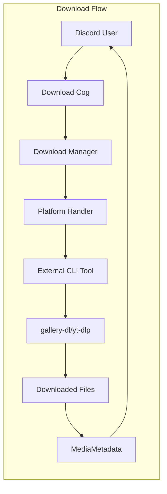
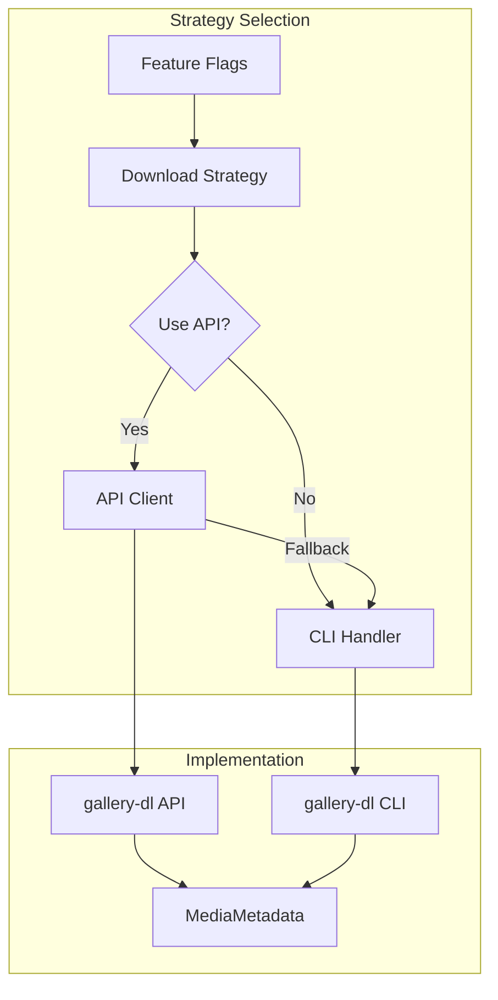

# Download System

This document explains Boss-Bot's download system architecture, covering both the current Handler pattern and the experimental Strategy pattern for platform-specific media downloads.

## System Overview

Boss-Bot supports downloading media from multiple platforms through a pluggable architecture that allows for different implementation approaches:

**Supported Platforms:**
- **Twitter/X**: Posts, threads, media content
- **Reddit**: Posts, comments, images, videos
- **Instagram**: Posts, stories (experimental)
- **YouTube**: Videos, playlists, audio extraction

**Implementation Approaches:**
- **Handler Pattern** (Current): CLI-based subprocess execution
- **Strategy Pattern** (Experimental): API-direct with CLI fallback

## Handler Pattern (Current Implementation)

### Architecture Overview

The Handler pattern provides a stable, CLI-based approach using external tools:



### Base Handler Interface

```python
# src/boss_bot/core/downloads/handlers/base_handler.py
from abc import ABC, abstractmethod
from boss_bot.schemas.discord import MediaMetadata

class BaseDownloadHandler(ABC):
    """Abstract base class for platform-specific download handlers."""

    def __init__(self, download_dir: Path):
        self.download_dir = download_dir

    @abstractmethod
    def download(self, url: str, **kwargs) -> MediaMetadata:
        """Download media from URL and return metadata."""
        pass

    @abstractmethod
    def supports_url(self, url: str) -> bool:
        """Check if this handler supports the given URL."""
        pass

    def _build_command(self, url: str, **kwargs) -> List[str]:
        """Build CLI command for external tool."""
        pass

    def _parse_metadata(self, output: str) -> MediaMetadata:
        """Parse CLI output into MediaMetadata."""
        pass
```

### Platform Handler Implementations

#### TwitterHandler

```python
# src/boss_bot/core/downloads/handlers/twitter_handler.py
class TwitterHandler(BaseDownloadHandler):
    """Handle Twitter/X downloads using gallery-dl."""

    def supports_url(self, url: str) -> bool:
        """Check if URL is from Twitter/X."""
        return any(domain in url.lower() for domain in ['twitter.com', 'x.com'])

    def download(self, url: str, **kwargs) -> MediaMetadata:
        """Download Twitter content via gallery-dl CLI."""
        command = [
            'gallery-dl',
            '--extract',                    # Extract metadata only
            '--write-info-json',           # Save metadata as JSON
            '--cookies-from-browser', 'firefox',  # Use browser cookies
            '--user-agent', 'Mozilla/5.0...',    # Set user agent
            url
        ]

        result = subprocess.run(command, capture_output=True, text=True)
        if result.returncode != 0:
            raise DownloadError(f"gallery-dl failed: {result.stderr}")

        return self._parse_twitter_metadata(result.stdout)
```

#### YouTubeHandler

```python
# src/boss_bot/core/downloads/handlers/youtube_handler.py
class YouTubeHandler(BaseDownloadHandler):
    """Handle YouTube downloads using yt-dlp."""

    def download(self, url: str, quality: str = "720p", **kwargs) -> MediaMetadata:
        """Download YouTube content with quality selection."""
        command = [
            'yt-dlp',
            '--format', f'best[height<={quality[:-1]}]',  # Quality selection
            '--write-info-json',                          # Save metadata
            '--extract-flat',                             # Extract info only
            url
        ]

        result = subprocess.run(command, capture_output=True, text=True)
        metadata = self._parse_youtube_metadata(result.stdout)

        # Add quality information
        metadata.quality = quality
        metadata.format_info = self._extract_format_info(result.stdout)

        return metadata
```

### Handler Registration and Discovery

```python
# src/boss_bot/core/downloads/manager.py
class DownloadManager:
    """Manages download operations across platforms."""

    def __init__(self, settings: BossSettings):
        self.settings = settings
        self.handlers = self._register_handlers()

    def _register_handlers(self) -> Dict[str, BaseDownloadHandler]:
        """Register all available download handlers."""
        return {
            'twitter': TwitterHandler(self.settings.download_dir),
            'reddit': RedditHandler(self.settings.download_dir),
            'instagram': InstagramHandler(self.settings.download_dir),
            'youtube': YouTubeHandler(self.settings.download_dir),
        }

    def get_handler(self, url: str) -> BaseDownloadHandler:
        """Find appropriate handler for URL."""
        for handler in self.handlers.values():
            if handler.supports_url(url):
                return handler
        raise UnsupportedURLError(f"No handler found for URL: {url}")
```

## Strategy Pattern (Experimental)

### Architecture Overview

The Strategy pattern enables switching between CLI and API implementations:



### Base Strategy Interface

```python
# src/boss_bot/core/downloads/strategies/base_strategy.py
from abc import ABC, abstractmethod

class BaseDownloadStrategy(ABC):
    """Strategy interface for download implementations."""

    @abstractmethod
    async def download(self, url: str, **kwargs) -> MediaMetadata:
        """Download using chosen strategy (CLI or API)."""
        pass

    @abstractmethod
    def supports_url(self, url: str) -> bool:
        """Check if strategy supports URL."""
        pass
```

### Feature Flag System

```python
# src/boss_bot/core/downloads/feature_flags.py
class DownloadFeatureFlags:
    """Feature flags for download implementations."""

    def __init__(self, settings: BossSettings):
        self.settings = settings

    @property
    def use_api_twitter(self) -> bool:
        """Use API-direct approach for Twitter downloads."""
        return self.settings.twitter_use_api_client

    @property
    def use_api_reddit(self) -> bool:
        """Use API-direct approach for Reddit downloads."""
        return self.settings.reddit_use_api_client

    @property
    def api_fallback_to_cli(self) -> bool:
        """Fallback to CLI if API fails."""
        return self.settings.download_api_fallback_to_cli
```

### Strategy Implementation Example

```python
# src/boss_bot/core/downloads/strategies/twitter_strategy.py
class TwitterDownloadStrategy(BaseDownloadStrategy):
    """Strategy for Twitter downloads with CLI/API choice."""

    def __init__(self, feature_flags: DownloadFeatureFlags, download_dir: Path):
        self.feature_flags = feature_flags
        self.download_dir = download_dir

        # Keep existing CLI handler (unchanged)
        self.cli_handler = TwitterHandler(download_dir=download_dir)

        # Lazy-loaded API client
        self._api_client = None

    @property
    def api_client(self):
        """Lazy load API client only when needed."""
        if self._api_client is None:
            from boss_bot.core.downloads.clients import AsyncGalleryDL
            self._api_client = AsyncGalleryDL()
        return self._api_client

    async def download(self, url: str, **kwargs) -> MediaMetadata:
        """Download using feature-flagged approach."""

        if self.feature_flags.use_api_twitter:
            try:
                return await self._download_via_api(url, **kwargs)
            except Exception as e:
                logger.warning(f"API download failed: {e}")
                if self.feature_flags.api_fallback_to_cli:
                    return await self._download_via_cli(url, **kwargs)
                raise
        else:
            return await self._download_via_cli(url, **kwargs)

    async def _download_via_cli(self, url: str, **kwargs) -> MediaMetadata:
        """Use existing CLI handler (unchanged behavior)."""
        loop = asyncio.get_event_loop()
        return await loop.run_in_executor(
            None, self.cli_handler.download, url, **kwargs
        )

    async def _download_via_api(self, url: str, **kwargs) -> MediaMetadata:
        """Use new API client."""
        async with self.api_client as client:
            async for item in client.download(url, **kwargs):
                return self._convert_api_response(item)
```

## API Client Implementation

### AsyncGalleryDL Client

```python
# src/boss_bot/core/downloads/clients/aio_gallery_dl.py
class AsyncGalleryDL:
    """Asynchronous wrapper around gallery-dl API."""

    def __init__(
        self,
        config: Optional[Dict[str, Any]] = None,
        config_file: Optional[Path] = None,
        cookies_file: Optional[Path] = None,
        cookies_from_browser: Optional[str] = None,
    ):
        self.config = config or {}
        self.config_file = config_file or Path("~/.gallery-dl.conf").expanduser()

        # Apply cookie settings
        if cookies_file:
            self.config.setdefault("extractor", {})["cookies"] = str(cookies_file)
        elif cookies_from_browser:
            self.config.setdefault("extractor", {})["cookies-from-browser"] = cookies_from_browser

    async def download(self, url: str, **options) -> AsyncIterator[Dict[str, Any]]:
        """Download content from URL asynchronously."""
        loop = asyncio.get_event_loop()

        # Run gallery-dl in thread pool to avoid blocking
        def _run_gallerydl():
            import gallery_dl
            job = gallery_dl.job.DownloadJob(url, self.config)
            job.run()
            return job.pathfmt.tempdir

        result = await loop.run_in_executor(None, _run_gallerydl)

        # Yield download results
        for file_info in result:
            yield {
                "url": file_info.get("url"),
                "filename": file_info.get("filename"),
                "extractor": file_info.get("extractor"),
                "metadata": file_info
            }

    async def extract_metadata(self, url: str) -> AsyncIterator[Dict[str, Any]]:
        """Extract metadata without downloading files."""
        loop = asyncio.get_event_loop()

        def _extract_metadata():
            import gallery_dl
            extractor = gallery_dl.extractor.find(url)
            if extractor:
                return list(extractor.items())
            return []

        items = await loop.run_in_executor(None, _extract_metadata)
        for item in items:
            yield item
```

### Configuration Management

```python
# src/boss_bot/core/downloads/clients/config/gallery_dl_config.py
from pydantic import BaseModel, Field, SecretStr

class TwitterConfig(BaseModel):
    """Twitter extractor configuration."""
    quoted: bool = True
    replies: bool = True
    retweets: bool = True
    videos: bool = True
    cookies: Optional[str] = None
    filename: str = "{category}_{user[screen_name]}_{id}_{num}.{extension}"
    directory: List[str] = ["twitter", "{user[screen_name]}"]

class GalleryDLConfig(BaseModel):
    """Root gallery-dl configuration with validation."""
    extractor: ExtractorConfig
    downloader: DownloaderConfig = DownloaderConfig()

    class Config:
        # Allow loading from JSON files
        json_encoders = {
            SecretStr: lambda v: v.get_secret_value() if v else None
        }
```

## MediaMetadata Schema

### Core Metadata Structure

```python
# src/boss_bot/schemas/discord/metadata.py
from pydantic import BaseModel
from typing import Optional, List, Dict, Any
from datetime import datetime

class MediaMetadata(BaseModel):
    """Unified metadata for downloaded media."""

    # Core identification
    platform: str                      # twitter, reddit, youtube, instagram
    url: str                           # Original URL
    id: Optional[str] = None           # Platform-specific ID

    # Content information
    title: Optional[str] = None        # Post/video title
    description: Optional[str] = None  # Content description
    author: Optional[str] = None       # Creator/uploader
    duration: Optional[int] = None     # Video duration (seconds)

    # Media files
    files: List[MediaFile] = []        # Downloaded files
    thumbnail: Optional[str] = None    # Thumbnail URL

    # Platform-specific metadata
    platform_data: Dict[str, Any] = {}  # Raw platform data

    # Download metadata
    download_timestamp: datetime = Field(default_factory=datetime.now)
    download_method: str = "cli"       # "cli" or "api"
    file_size_bytes: Optional[int] = None
    quality: Optional[str] = None      # Video quality (720p, 1080p, etc.)

    # Social metadata (when available)
    like_count: Optional[int] = None
    retweet_count: Optional[int] = None
    view_count: Optional[int] = None
    comment_count: Optional[int] = None

class MediaFile(BaseModel):
    """Individual media file information."""
    filename: str
    filepath: Path
    file_type: str                     # image, video, audio
    mimetype: str                      # image/jpeg, video/mp4, etc.
    size_bytes: int
    checksum: Optional[str] = None     # File integrity check
```

### Platform-Specific Extensions

```python
# Twitter-specific metadata extensions
class TwitterMetadata(MediaMetadata):
    """Twitter-specific metadata fields."""
    tweet_id: str
    user_screen_name: str
    is_retweet: bool = False
    is_quote_tweet: bool = False
    thread_position: Optional[int] = None

    class Config:
        # Ensure platform is always "twitter"
        schema_extra = {"platform": "twitter"}

# YouTube-specific metadata extensions
class YouTubeMetadata(MediaMetadata):
    """YouTube-specific metadata fields."""
    video_id: str
    channel_name: str
    channel_id: str
    upload_date: datetime
    categories: List[str] = []
    tags: List[str] = []
    is_livestream: bool = False
    format_info: Dict[str, Any] = {}   # Available formats/qualities
```

## Configuration and Environment Variables

### Feature Flag Environment Variables

```bash
# Enable API-direct for specific platforms
export TWITTER_USE_API_CLIENT=true
export REDDIT_USE_API_CLIENT=false
export INSTAGRAM_USE_API_CLIENT=false
export YOUTUBE_USE_API_CLIENT=false

# Fallback behavior
export DOWNLOAD_API_FALLBACK_TO_CLI=true

# Gallery-dl configuration
export GALLERY_DL_CONFIG_FILE="~/.gallery-dl.conf"
export GALLERY_DL_COOKIES_FROM_BROWSER="firefox"
export GALLERY_DL_USER_AGENT="Mozilla/5.0 (compatible; BossBot/1.0)"
```

### BossSettings Integration

```python
# src/boss_bot/core/env.py
class BossSettings(BaseSettings):
    """Bot configuration with download system settings."""

    # Download system configuration
    download_dir: Path = Field(default=Path("./downloads"))
    max_file_size: int = Field(default=100_000_000)  # 100MB
    max_concurrent_downloads: int = Field(default=3)

    # Feature flags for experimental features
    twitter_use_api_client: bool = Field(default=False)
    reddit_use_api_client: bool = Field(default=False)
    instagram_use_api_client: bool = Field(default=False)
    youtube_use_api_client: bool = Field(default=False)
    download_api_fallback_to_cli: bool = Field(default=True)

    # Gallery-dl configuration
    gallery_dl_config_file: Path = Field(default=Path("~/.gallery-dl.conf"))
    gallery_dl_cookies_file: Optional[Path] = Field(default=None)
    gallery_dl_cookies_from_browser: Optional[str] = Field(default=None)
    gallery_dl_user_agent: str = Field(
        default="Mozilla/5.0 (X11; Linux x86_64; rv:91.0) Gecko/20100101 Firefox/91.0"
    )
```

## Error Handling and Resilience

### Error Hierarchy

```python
# src/boss_bot/core/downloads/exceptions.py
class DownloadError(Exception):
    """Base exception for download operations."""
    pass

class UnsupportedURLError(DownloadError):
    """URL is not supported by any handler."""
    pass

class QuotaExceededError(DownloadError):
    """User or guild storage quota exceeded."""
    pass

class DownloadTimeoutError(DownloadError):
    """Download operation timed out."""
    pass

class ExternalToolError(DownloadError):
    """External tool (gallery-dl/yt-dlp) failed."""
    def __init__(self, tool: str, returncode: int, stderr: str):
        self.tool = tool
        self.returncode = returncode
        self.stderr = stderr
        super().__init__(f"{tool} failed with code {returncode}: {stderr}")
```

### Retry and Fallback Logic

```python
async def download_with_retry(
    strategy: BaseDownloadStrategy,
    url: str,
    max_retries: int = 3,
    **kwargs
) -> MediaMetadata:
    """Download with automatic retry and fallback."""

    last_exception = None

    for attempt in range(max_retries):
        try:
            return await strategy.download(url, **kwargs)
        except (DownloadTimeoutError, ExternalToolError) as e:
            last_exception = e
            if attempt < max_retries - 1:
                wait_time = 2 ** attempt  # Exponential backoff
                logger.warning(f"Download attempt {attempt + 1} failed, retrying in {wait_time}s: {e}")
                await asyncio.sleep(wait_time)
            else:
                logger.error(f"All {max_retries} download attempts failed")

    raise last_exception
```

## Performance Considerations

### Async/Await Patterns

- **CLI Operations**: Execute in thread pool via `loop.run_in_executor()`
- **API Operations**: Native async with proper context management
- **File I/O**: Use `aiofiles` for non-blocking file operations
- **Concurrent Downloads**: Semaphore-based rate limiting

### Resource Management

```python
# Concurrent download limiting
async def download_multiple(urls: List[str], max_concurrent: int = 3):
    """Download multiple URLs with concurrency control."""
    semaphore = asyncio.Semaphore(max_concurrent)

    async def download_one(url: str):
        async with semaphore:
            return await strategy.download(url)

    tasks = [download_one(url) for url in urls]
    return await asyncio.gather(*tasks, return_exceptions=True)
```

This download system provides both stability through the proven Handler pattern and innovation through the experimental Strategy pattern, enabling gradual adoption of new features while maintaining backward compatibility.
